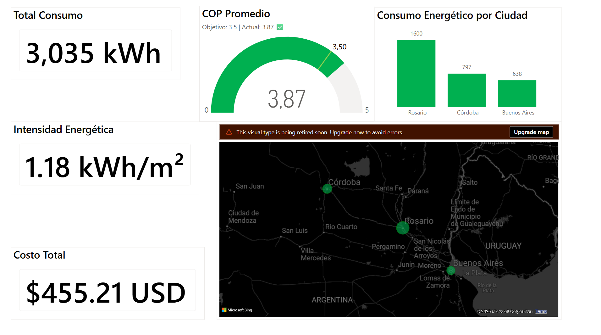

# IoT Monitoring & Analytics Pipeline



[](https://cloud.google.com/bigquery)
[](https://www.python.org/)
[](LICENSE)

> Proyecto de ingeniería de datos con pipeline end-to-end: desde generación de datos sintéticos IoT hasta visualización en Power BI, implementando arquitectura medallion en BigQuery.

> **Nota**: Proyecto sin fines de lucro. El dataset es completamente sintético, basado en el paper académico citado.

## 📋 Descripción

Pipeline completo para monitoreo IoT de refrigeración industrial. Incluye BigQuery, y visualización en Power BI. 
</br>He utilizado el paper **"Energy Monitoring IoT System based on Open Hardware and Software"** para procesarlo con NotebookLM y crear un punto de partida para la creación del dataset posteriormente con [Polars](https://docs.pola.rs/).</br>

### 🎯 Objetivos

- **Pipeline ETL**: Generación → Ingestión → Transformación → Visualización
- **KPIs energéticos**: kWh/m²/mes, COP, eficiencia vs baseline
- **Detección de anomalías**: Temperatura, presión, consumo
- **Dashboard Power BI**: `report.pbix` con análisis ejecutivo

## 🏗️ Arquitectura

```
┌─────────────────┐
│  IoT Sensors    │  ← Datos sintéticos (3 tiendas × 7 días)
│  (Synthetic)    │     EWCM9100 + CVM-MINI simulados
└────────┬────────┘
         │
         ▼
┌─────────────────┐
│  Python/Polars  │  ← Generación de datos realistas
│  Data Generator │     Variación diurna, ciclos, alarmas
└────────┬────────┘
         │
         ▼
┌─────────────────┐
│   BigQuery      │  ← Bronze → Silver → Gold Layers
│  Data Warehouse │     Particionado + Clustering
└────────┬────────┘
         │
         ▼
┌─────────────────┐
│  SQL Analytics  │  ← 8 queries de análisis + KPIs
│  & KPIs         │
└────────┬────────┘
         │
         ▼
┌─────────────────┐
│   Power BI      │  ← report.pbix (✅ Disponible)
│  Dashboard      │
└─────────────────┘
```

## 📊 Datasets

### Tabla: `installation_metadata`
Información estática de 3 instalaciones monitoreadas:

| Campo | Descripción | Ejemplo |
|-------|-------------|---------|
| `installation_id` | Identificador único | STORE_ARG_001 |
| `cabinet_type` | Tipo de gabinete | fruit/meat/frozen |
| `square_meters` | Área del local (m²) | 850.0 |
| `city` | Ubicación | Buenos Aires |

### Tabla: `sensor_measurements` (Bronze Layer)
30,240 registros de sensores (cada minuto):

- **Temperaturas**: evaporador, succión, descarga, ambiente, gabinete
- **Presiones**: succión, descarga
- **Consumo eléctrico**: potencia, energía, corrientes trifásicas, voltaje
- **Estados**: compresor, descongelamiento, puerta abierta
- **Alarmas**: temperatura alta, presión baja/alta

### Tabla: `kpi_energy_monthly` (Gold Layer)
KPIs agregados mensuales:

- **KPI Principal**: `energy_per_sqm` (kWh/m²/mes)
- **Eficiencia**: COP estimado, ratio vs baseline
- **Operación**: runtime de compresor, ciclos, alarmas
- **Temperatura**: tiempo fuera de rango, desviaciones

<details>
<summary>❄️ ¿Qué es el COP?</summary>

El Coeficiente de Rendimiento (COP) es una relación adimensional (no tiene unidades) que compara la potencia frigorífica producida por el equipo (el "resultado" deseado) con la potencia eléctrica que consume el compresor (el "gasto" o energía que se necesita).

$$\text{COP} = \frac{\text{Potencia Frigorífica o Calor Extraído (kW)}}{\text{Potencia Eléctrica Consumida (kW)}} = \frac{Q_L}{W_{\text{entrada}}}$$

**Potencia Frigorífica ($Q_L$)**: La cantidad de calor que el sistema de refrigeración logra extraer de un espacio o producto (el "efecto de enfriamiento").

**Potencia Eléctrica Consumida ($W_{\text{entrada}}$)**: La energía eléctrica que consume el compresor para hacer funcionar el ciclo de refrigeración.

### 📈 Importancia

- **Mayor COP = Mayor Eficiencia**: Cuanto más alto es el valor del COP, más eficiente es el refrigerador. Esto significa que el equipo puede extraer una mayor cantidad de calor (producir más frío) por cada kilovatio (kW) de electricidad que consume.
- **Ahorro de Costos**: Un COP alto se traduce directamente en menores costos operativos y un ahorro en la factura de electricidad.
- **Sostenibilidad**: Indica un menor impacto ambiental, ya que el sistema hace un uso más eficiente de la energía.

**Ejemplo**: Si un refrigerador industrial tiene un COP = 4, significa que por cada 1 kW de electricidad consumida, el sistema proporciona 4 kW de potencia frigorífica (frío). En cambio, un sistema con COP = 2 solo daría 2 kW de frío por el mismo gasto de 1 kW.

</details>

## 🚀 Inicio Rápido

### Prerrequisitos
```bash
pip install polars numpy google-cloud-bigquery pyarrow
gcloud auth application-default login
```

### Setup y Deployment
```bash
# 1. Crear infraestructura BigQuery
cd sql_queries/IoT_Monitoring_Dataset
bq query --use_legacy_sql=false < 01_create_installation_metadata.sql
bq query --use_legacy_sql=false < 02_create_sensor_measurements.sql
bq query --use_legacy_sql=false < 03_create_kpi_monthly.sql
python ../../scripts/04_generate_synthetic_data.py  # 30,240 rows
bq query --use_legacy_sql=false < 04_calculate_kpis.sql

# 2. Crear vistas Power BI (validar primero con --dry_run)
cd ../PBID
bq query --use_legacy_sql=false < 01_views_hourly_metrics.sql
bq query --use_legacy_sql=false < 02_views_kpis_with_metadata.sql
bq query --use_legacy_sql=false < 03_views_benchmarking.sql
bq query --use_legacy_sql=false < 04_views_alarm_analysis.sql

# 3. Abrir Dashboard Power BI
# - Archivo: report.pbix
# - Credenciales BigQuery configuradas automáticamente
```

## 📈 Análisis Disponibles

### **SQL Queries** (`IoT_Monitoring_Dataset/`)
1. **Eficiencia Energética** (05) - Rankings y benchmarking
2. **Patrones Operativos** (06) - Consumo por hora, anomalías
3. **KPI Temperatura** (07) - % tiempo fuera de rango
4. **KPI Descongelamiento** (08) - Eficiencia de ciclos

### **Power BI Views** (`PBID/`) - ✅ Desplegadas
1. **vw_hourly_metrics** - Métricas horarias cada 6h (reducción 90%)
2. **vw_kpis_with_metadata** - KPIs con geo (location_full para mapas)
3. **vw_benchmarking** - Comparativa entre instalaciones
4. **vw_alarm_analysis** - Patrones de alarmas y mantenimiento

## 📂 Estructura del Proyecto

```
gcp-analytics/
├── README.md
├── powerbi_theme.json                    🎨 Tema corporativo (importar en PBI)
├── sql_queries/
│   ├── IoT_Monitoring_Dataset/          # Bronze → Gold (8 archivos)
│   └── PBID/                            # Vistas Power BI ✅ Desplegadas
│       ├── 01_views_hourly_metrics.sql      (cada 6h, temp + potencia)
│       ├── 02_views_kpis_with_metadata.sql  (KPIs + geo Argentina)
│       ├── 03_views_benchmarking.sql        (rankings instalaciones)
│       └── 04_views_alarm_analysis.sql      (análisis alarmas)
└── scripts/
    └── 04_generate_synthetic_data.py
```

## 🎨 Paleta de Colores Corporativa

Tema estandarizado para todos los dashboards de Power BI definido en `powerbi_theme.json`:

### **Colores de Eficiencia**
- 🟢 **Verde Excelente** `#00B050` - Valores óptimos (< 30 kWh/m²)
- 🟢 **Verde Claro** `#92D050` - Valores buenos (30-40 kWh/m²)
- 🟡 **Amarillo Warning** `#FFC000` - Valores regulares (40-50 kWh/m²)
- 🔴 **Rojo Crítico** `#C00000` - Valores críticos (> 50 kWh/m²)

### **Colores COP (Coefficient of Performance)**
- 🟢 **Verde** `#00B050` - COP ≥ 3.5 (Eficiente)
- 🟡 **Amarillo** `#FFC000` - COP 2.5-3.5 (Aceptable)
- 🔴 **Rojo** `#C00000` - COP < 2.5 (Ineficiente)

### **Colores de Alarmas**
- 🔴 **Rojo Crítico** `#FF0000` - Alarma crítica
- 🟠 **Naranja Alta** `#FF8800` - Prioridad alta
- 🟡 **Amarillo Media** `#FFCC00` - Prioridad media
- 🔵 **Azul Info** `#0070C0` - Información

### **Colores Corporativos**
- 🔵 **Azul Corporativo** `#0070C0` - Color principal
- ⚫ **Gris Neutro** `#7F7F7F` - Secundario
- ⚪ **Blanco** `#FFFFFF` - Fondo
- ⬛ **Negro** `#000000` - Texto

### **Aplicar en Power BI Desktop**
1. **Ver** → **Temas** → **Examinar temas**
2. Seleccionar `powerbi_theme.json`
3. ✅ Colores aplicados automáticamente a todos los visuales

## 🎯 KPIs Principales

| KPI | Métrica | Objetivo |
|-----|---------|----------|
| **Eficiencia Energética** | kWh/m²/mes | <30 kWh/m² (fruit), <40 (frozen) |
| **Cumplimiento de Temperatura** | % tiempo en rango | >95% |
| **Eficiencia de Descongelamiento** | Ratio defrost/runtime | <0.1 |
| **Uptime del Compresor** | % tiempo operativo | 90-95% |
| **COP Estimado** | Cooling/Power | >2.5 |

## 📊 Dashboards Power BI Implementados

### **Dashboard 01: Métricas Horarias** ✅
- Temperatura de gabinete por hora (cada 6h)
- Gráfico 100% stacked column por instalación
- Consumo energético y patrones operativos

### **Dashboard 02: KPIs Operativos** ✅
- Tarjetas: Total Consumo (3,035 kWh), Intensidad (1.18 kWh/m²), Costo ($455 USD)
- Gauge COP: Actual 3.87 vs Objetivo 3.5
- Mapa Argentina: Consumo por ciudad (location_full)
- Gráfico barras: Consumo por ciudad
- Líneas: Intensidad energética temporal

### **Configuración Aplicada**
- ✅ Tema corporativo importado (`powerbi_theme.json`)
- ✅ Colores: Verde (#00B050) Excelente, Amarillo (#FFC000) Regular, Rojo (#C00000) Crítico
- ✅ Medidas DAX con unidades (kWh, kWh/m², USD, COP)
- ✅ Geolocalización Argentina corregida

## 🔮 Próximos Pasos

- [ ] **Dashboard 03**: Benchmarking y rankings
- [ ] **Dashboard 04**: Análisis de alarmas y mantenimiento
- [ ] Slicers interactivos (ciudad, tipo gabinete, fechas)
- [ ] Drill-through por instalación
- [ ] Alertas automáticas (Cloud Functions)
- [ ] Modelo ML predicción de fallas

## 🛠️ Validación de Queries

Usar `--dry_run` antes de ejecutar para evitar costos:

```bash
bq query --dry_run --use_legacy_sql=false < sql_queries/PBID/01_views_hourly_metrics.sql
```

**Estado de Vistas PBID**: ✅ Todas desplegadas y funcionando

## 📚 Referencias

- **Paper Original**: ["Energy Monitoring IoT System based on Open Hardware and Software"](https://riunet.upv.es/server/api/core/bitstreams/3a15d528-3bfd-4b87-b49b-408af7aff595/content) - RiuNet, Universitat Politècnica de València
- **Hardware Referenciado**: 
  - Gateway: Siemens SIMATIC IOT2040
  - Controlador: Eliwell EWCM9100
  - Medidor: Circutor CVM-MINI

## 🛠️ Tecnologías Utilizadas

- **Google Cloud Platform**
  - BigQuery (Data Warehouse)
  - Cloud Storage (Almacenamiento)
  - Cloud SDK (CLI)
- **Python 3.13.5+**
  - Polars (Data manipulation)
  - NumPy (Generación de datos)
  - google-cloud-bigquery (Cliente BigQuery)
- **SQL** (BigQuery Standard SQL)

## 👥 Contribuciones

Este es un proyecto personal de aprendizaje. Sugerencias y feedback son bienvenidos.

## 📄 Licencia

MIT License

---

**Autor**: Andres Vergara  
**Fecha**: Noviembre 2025  